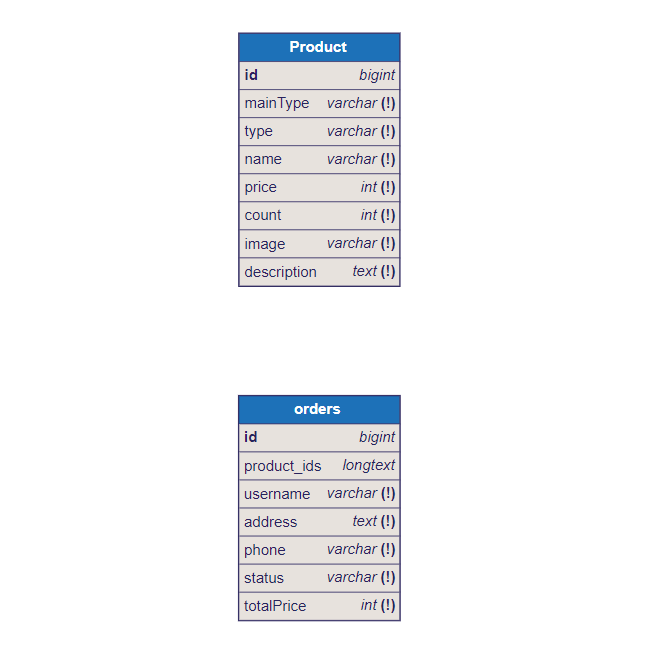

# VoloknoBack - серверная часть интернет магазина

## Сущности

### Product

#### Поля:

- **id** - уникальный идентификационный номер продукта;
- **mainType** - Основной тип продукта;
- **type** - Тип продукта;
- **name** - Название продукта;
- **price** - Цена продукта;
- **count** - Колличество товара;
- **image** - сcылка на изображение продукта;
- **description** - Описание продукта;

### Order

#### Поля:

- **id** - уникальный идентификационный номер продукта;
- **product_ids** - Уникальные идентификаторы продуктов клиента;
- **username** - Имя клиента;
- **address** - Адрес куда доставить;
- **phone** - Контактный телефон клиента;
- **status** - Статус заказа;
- **totalPrice** - Общая стоимость заказа;

## Cхема таблиц




## Запуск 

### команды

команда для первого запуска контейнера 
```
docker-compose up --build
```
команда для последующего запуска docker-compose
``` 
docker-compose up
```
установка sequelize с доп библиотеками ( драйвер PostgreSQL (pg), и дополнительный модуль (pg-hstore), который используется для хранения данных в формате hstore.)
```
npm install sequelize pg pg-hstore
```
дополнительный пакет Sequelize CLI, который предоставляет команды для создания и выполнения миграций.
```
npm install sequelize-cli
```
создание миграции для модели
```
npx sequelize-cli migration:generate --name <имя_миграции>
```
запускает файлы миграции для того чтобы они появились в db
```
npx sequelize-cli db:migrate
```
для создания файла seed
```
npx sequelize-cli seed:generate --name <SeederName>
```
для запуска seed
```
npx sequelize-cli db:seed --seed <seed-file-name>
```